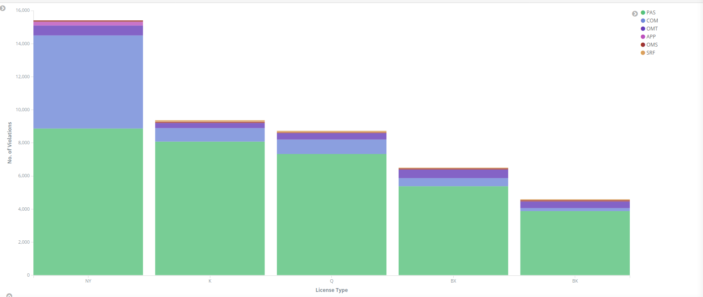
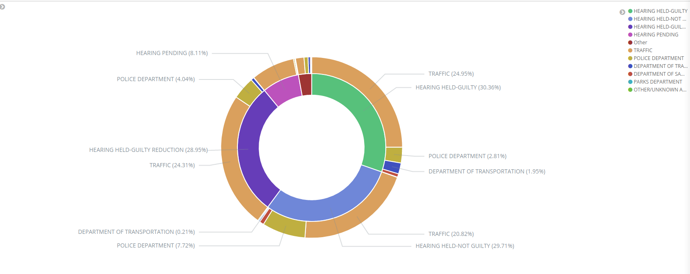
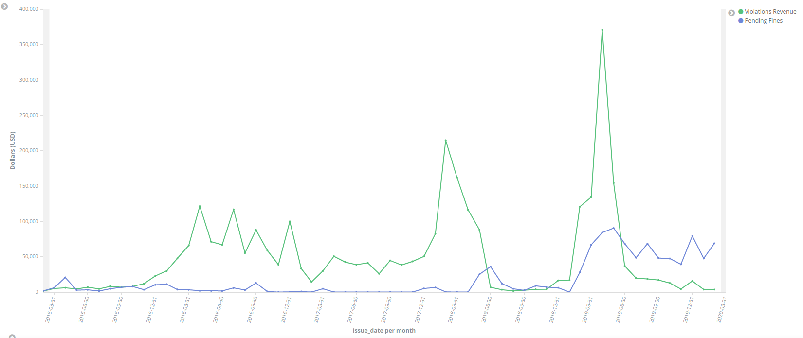
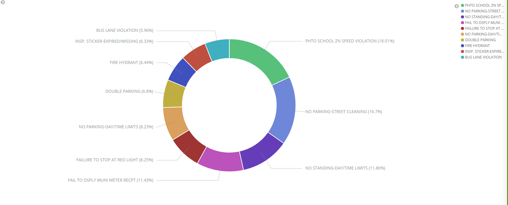
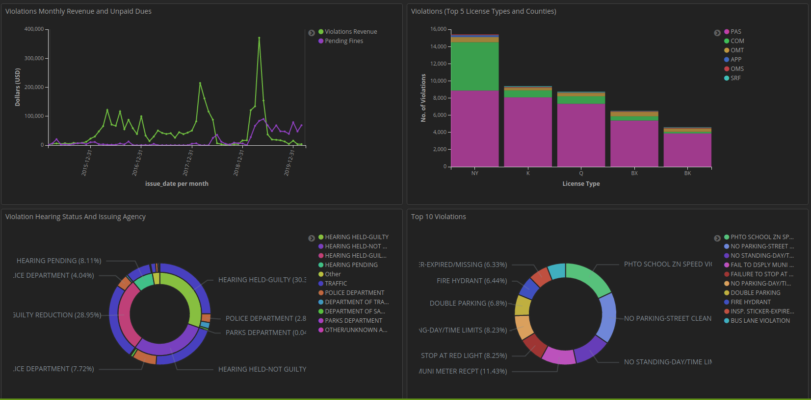

# STA9760 Project Part 2 & Part 3

## Project Overview
In this part of the project, we extract data of NYC Parking Violations from NYC Opendata and push it to Elasticsearch and Kibana.

### Requirements
1. App_Token from NYC Open Data. Link: https://data.cityofnewyork.us/login
2. Github Account
4. AWS account (if operating on an EC2 machine)

### Links to Repositories

Github: https://github.com/sanketpatel0512/STA9760-Project-Part_2


### Run From Github

#### Step 1: Copy all files from github in target folder

#### Step 2: Build Docker Container
```sh
~$ sudo docker-compose up -d
```
#### Step 3: Run Docker Container
```sh
~$ sudo docker-compose run -e APP_KEY={Your App Token from Socrata} bigdata2 python main.py --page_size={Enter No. of Records to pull per call} --num_pages={Enter No. of Calls to Database} --output=./outputs/{output filename with format}
```

APP_KEY - (Required Input)It is the App token from NYC OpenData


--page_size - (Required Input) Number of Records to pull per call


--num_pages - (Optional) Number of Calls to make to Database. It will pull complete database of no input provided.


--output - (Optional) Output file for data storage. Program will print data in STDOUT if no input provided.

### Output

The output of the program is json formatted datastring. Each record is written on a new line in the output file.

The Data is also uploaded to ElasticSearch and can be accessed at the following URL:

localhost:9200

### Kibana Visuals

The output is also accessible in Kibana for visualization. Use the following URL:

localhost:5601

### Examples of Visuals and Data Analysis using Kibana

#### Top 5 counties and license types with highest violations



Based on the above, we can conclude that Passenger Vehicles commit highest violations and NY county has highest violations followed by Kings County


#### Status of Hearings



Based on the above visual, approximately 55% of offenders are found guilty of the violations committed and 29% are found not guilty. Approx. 8% hearings are still pending. Traffic Depart issues the maximum violation tickets followed by the police department.


#### Revenue Generated From Violations and Unpaid Revenue



Based on the above visuals, we notice a considerable rise in the revenue collection in 2015 which might be due to increase in vehicles or a change in administration leading to stricter rules. We also notice that in the recent months unpaid fines amount is higher than fines paid.

#### Top 5 Violations



This visual highlights the top 5 violations commited in NYC.


#### Combined Visual Dashboard



This is a combined dasboard of the above 4 visuals
